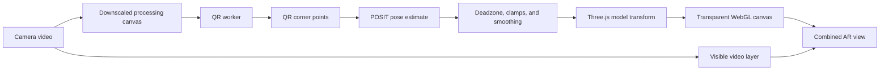

Augmented Reality QR code tracker
=====================================


This Augmented Reality application tracks QR codes and places 3D models on it. The application acocmplishes this by identifying the QR code displayed on a camera, measuring the scale, position, and distortion of hte QR Code, then sending their information to ThreeJS to place the model. Multiple model formats are supported: STL (binary/ASCII), glTF 2.0 (`.gltf` / `.glb`), legacy Three.js JSON, and Three.js Object/Editor JSON.

The tracker can optionally target one QR code by requiring an exact, case-sensitive payload match. Leave `tracking.trackMatchingQRCodeData` empty to preserve the original behavior of accepting the first decoded QR code.

This is based off the ar3d github project found at https://github.com/jeromeetienne/ar3d

which could be previewed at: [https://ar3d.surge.sh](https://ar3d.surge.sh)


## QR scanning behavior

This app first tries the native [Shape Detection API](https://wicg.github.io/shape-detection-api/#barcode-detection-api) (`BarcodeDetector`) to detect and anlize the QR Code.

If `BarcodeDetector` is unavailable in the browser, or it fails to run, the app automatically falls back to the local QR decoder library under [scripts/jsqrcode](scripts/jsqrcode).

Set `tracking.trackMatchingQRCodeData` in [src/config/render-config.json](src/config/render-config.json) to the exact text encoded in the QR code that should control the model. The native `BarcodeDetector` path checks every QR result in a frame for that match. The bundled software fallback can decode at most one candidate per frame, so it accepts that candidate only when its payload matches.

Unlike the original ar3d project, this app does not need experimental browser flags for the fallback path.

This app does requires a browser that has webcam support as well as functional webcam hardware.

## Libraries used in this application

This project is intentionally self-contained and uses unminified source files where possible. This allows for long-term viability, as well as easy editing, maintance, and customization.

The libraries used in this project are listed in the following table -- the links were last verified 2026-07-07, and no garuntees are made that they still exist outside this project.


| Library/component Name | Local file(s) used and location | Original source | Version/data in source | License | Purpose |
|---|---|---|---|---|---|
| three.js | [src/libs/three/three.js](src/libs/three/three.js) | [three.js GitHub](https://github.com/mrdoob/three.js) | Source contains `REVISION = '132'` | MIT (three.js standard license) | Core 3D scene, camera, mesh, text, and animation rendering |
| AR.js + jsartoolkit5 marker stack | Removed from this lightweight copy (legacy files were previously under scripts/js) | [AR.js GitHub](https://github.com/AR-js-org/AR.js) and [jsartoolkit5 GitHub](https://github.com/artoolkitx/jsartoolkit5) | N/A in this copy | AR.js/jsartoolkit5 upstream license terms (commonly LGPL-3.0/BSD-style components, depending on upstream submodule) | Legacy marker-based AR pipeline (not used by the current QR runtime) |
| JavaScript MD5 (blueimp) | [src/libs/blueimp-md5/md5.js](src/libs/blueimp-md5/md5.js) | [blueimp JavaScript-MD5 GitHub](https://github.com/blueimp/JavaScript-MD5) | Header shows Copyright 2011; includes reference to Paul Johnston implementation (`Version 2.2`, 1999-2009) | MIT (with historical BSD attribution in header comments) | Utility library |
| js-aruco POS (pose estimation) | [src/libs/js-aruco/src/posit1.js](src/libs/js-aruco/src/posit1.js), [src/libs/js-aruco/src/svd.js](src/libs/js-aruco/src/svd.js) | [js-aruco GitHub (Juan Mellado)](https://github.com/jcmellado/js-aruco) | Headers show Copyright 2012 | MIT | Used for pose estimation in [src/main.js](src/main.js) |
| jsqrcode decoder stack (software QR fallback) | [scripts/jsqrcode](scripts/jsqrcode) | [LazarSoft jsqrcode GitHub](https://github.com/LazarSoft/jsqrcode) and [ZXing GitHub](https://github.com/zxing/zxing) | Headers show `Copyright 2011 Lazar Laszlo` and multiple files with `Copyright 2007 ZXing authors` | Apache License 2.0 | Loaded inside worker via [scripts/jsqrcode/qrworker.js](scripts/jsqrcode/qrworker.js) for fallback QR decoding |
| Material Design Lite runtime (UI helper) | [src/libs/material.js](src/libs/material.js) | [Material Design Lite GitHub](https://github.com/google/material-design-lite) and [cdnjs source used in file header](https://cdnjs.cloudflare.com/ajax/libs/material-design-lite/1.3.0/material.js) | File header references version `1.3.0` source URL | Apache License 2.0 | Local copy loaded by [index.html](index.html), replacing previous CDN dependency |
| GLTFLoader (GLTF 2.0 format) | [src/libs/GLTFLoader.js](src/libs/GLTFLoader.js) | [three.js examples](https://github.com/mrdoob/three.js/blob/master/examples/js/loaders/GLTFLoader.js) | Loaded from Three.js examples | MIT | Supports `.gltf` and `.glb` (binary) model files; called by [src/main.js](src/main.js) based on file extension |
| STLLoader (binary & ASCII STL format) | [src/libs/STLLoader.js](src/libs/STLLoader.js) | [three.js examples](https://github.com/mrdoob/three.js/blob/master/examples/js/loaders/STLLoader.js) | Loaded from Three.js examples | MIT | Supports `.stl` model files (Stereolithography/CAD format); called by [src/main.js](src/main.js) based on file extension |
| LegacyJSONLoader (Three.js JSON format) | [src/libs/LegacyJSONLoader.js](src/libs/LegacyJSONLoader.js) | [three.js examples](https://github.com/mrdoob/three.js/blob/master/examples/js/loaders/LegacyJSONLoader.js) | Loaded from Three.js examples | MIT | Supports `.json` model files (legacy Three.js JSON format); includes embedded materials and geometry; called by [src/main.js](src/main.js) based on file extension |

### Browser APIs used (not third-party libraries)

- `BarcodeDetector` (Shape Detection API), when available
- `Worker` and `importScripts` for QR decoding off main thread
- `getUserMedia` webcam capture APIs
- Canvas 2D + WebGL via three.js

## How this app works (beginner walkthrough)

This section explains the app as if you are new to JavaScript and web graphics.

### Big picture

The app does 4 main jobs in a loop:

1. Read video frames from your webcam.
2. Find and decode a QR code in each frame.
3. Estimate the QR code's position and rotation in 3D space.
4. Draw a 3D object on top of the camera view so it looks "attached" to the code.

### File-by-file responsibilities

- [index.html](index.html)
Loads the page, adds `<video>` and `<canvas>`, and includes all JavaScript files in order.

- [src/main.js](src/main.js)
The main controller. It starts the camera, sets up the 3D scene, requests QR decoding, starts embedded model clips, and updates tracking and animation every frame.

- [src/qrclient.js](src/qrclient.js)
Creates a Web Worker and sends camera image data to it. This keeps heavy QR processing off the main UI thread.

- [scripts/jsqrcode/qrworker.js](scripts/jsqrcode/qrworker.js)
Runs QR detection in the background thread. It tries native `BarcodeDetector` first, then falls back to local software QR decoding.

- [scripts/jsqrcode](scripts/jsqrcode)
Local QR decoding implementation (self-contained fallback path).

- [src/libs/js-aruco/src/posit1.js](src/libs/js-aruco/src/posit1.js)
Takes QR corner points and calculates 3D pose (translation + rotation).

- [src/libs/three/three.js](src/libs/three/three.js)
Draws the 3D scene (camera, cube, text, lights) in WebGL.

- [src/libs/GLTFLoader.js](src/libs/GLTFLoader.js), [src/libs/STLLoader.js](src/libs/STLLoader.js), [src/libs/LegacyJSONLoader.js](src/libs/LegacyJSONLoader.js)
Three.js loaders for different model formats. The active loader is selected in [src/main.js](src/main.js) based on the model file extension (`.gltf` / `.glb` / `.stl` / `.json`).

### Runtime flow (step by step)

1. Page load
`index.html` loads scripts and the browser creates the `<video>` and `<canvas>` elements.

2. Camera setup
`main.js` asks for webcam permission using `getUserMedia`, then starts video playback.

3. Scene setup
`main.js` creates a Three.js scene, camera, light, and text objects. A 3D model is loaded based on `render.model.path` in [src/config/render-config.json](src/config/render-config.json), auto-detected from file extension.

4. Frame loop starts
`requestAnimationFrame` creates a repeating render loop (roughly 60 times/second).

5. QR decode request
Each loop, the current video frame is copied to an offscreen canvas and sent to the worker through `qrclient.js`.

6. Worker decoding
The worker in `qrworker.js` tries native `BarcodeDetector`. If unavailable/failing, it uses local files in `scripts/jsqrcode`. Before returning QR corners, it applies the optional exact-payload filter configured by `tracking.trackMatchingQRCodeData`.

7. Pose estimation
When a QR code is found, the corner points are sent back. `main.js` passes those points to POSIT (`posit1.js`) to calculate position/rotation.

8. 3D update
`main.js` advances any embedded model animations, moves and rotates the tracked model and text to match the QR code pose, then renders with Three.js.

### Why a Web Worker is important

QR decoding can be expensive. If decoding runs on the main thread, the page can stutter or freeze.
By decoding in a worker, UI rendering stays smooth while scanning happens in parallel.

### Common beginner confusion points

- "Why do we need both `video` and `canvas`?"
`video` shows camera input. `canvas` is where we draw/process frames and render 3D overlays.

- "Why does script order in `index.html` matter?"
Some files depend on globals created by earlier files. Loading in the wrong order causes `ReferenceError` problems.

- "Why are there two QR paths (native + fallback)?"
Not all browsers support `BarcodeDetector` equally. The fallback ensures the app still works.

- "Where is the app state stored?"
Mostly in variables inside `main.js` (last barcode, scene objects, camera state, scan flags).

### If you want to learn by experimenting

Good first edits:

1. Change the model displayed in [src/config/render-config.json](src/config/render-config.json).
2. Log worker messages in [src/qrclient.js](src/qrclient.js) and [scripts/jsqrcode/qrworker.js](scripts/jsqrcode/qrworker.js).
3. Temporarily disable `BarcodeDetector` path in [scripts/jsqrcode/qrworker.js](scripts/jsqrcode/qrworker.js) to test fallback behavior.

## How to add QR tracking to your own three.js project

This is a practical migration checklist for reusing this QR tracking approach in a different project.

### What you need to copy

At minimum, copy these parts into your own project:

1. QR worker client: [src/qrclient.js](src/qrclient.js)
2. Worker entry: [scripts/jsqrcode/qrworker.js](scripts/jsqrcode/qrworker.js)
3. Local QR decoder files: [scripts/jsqrcode](scripts/jsqrcode)
4. Pose estimation files: [src/libs/js-aruco/src/posit1.js](src/libs/js-aruco/src/posit1.js) and [src/libs/js-aruco/src/svd.js](src/libs/js-aruco/src/svd.js)

If your target project already has three.js, do not duplicate it. Reuse your existing three.js import.

### Integration steps

1. Add scripts in the right order

Load SVD before POSIT, then your app logic. In this repo, the order is shown in [index.html](index.html).

2. Start webcam capture

Use `getUserMedia` to stream video into a hidden/visible `<video>` element.

3. Create a small processing canvas

Draw each camera frame to an offscreen canvas. This gives you `ImageData` for decoding.

4. Decode in a worker

Instantiate `QRClient`, send `ImageData`, and receive either:

- `undefined` (no QR found), or
- a result object with `rawValue` and `cornerPoints`.

5. Convert corner coordinates for your scene

Transform QR corner points from image coordinates into your render coordinate space.

6. Estimate 3D pose with POSIT

Create a POSIT instance once, then call `pose(centeredPts)` for each detected frame.

7. Apply pose to your three.js object

Map translation/rotation into your mesh (or group) and render.

8. Run in an animation loop

Keep decode + render inside `requestAnimationFrame` (or decode on a throttled cadence if needed).

### Minimal architecture pattern

Use this mental model:

Camera frame -> Offscreen canvas -> Worker decode -> Corner points -> POSIT pose -> Update three.js object -> Render

### Important implementation details

1. Keep decoding off the main thread

Do not run QR decode directly in your render loop on the main thread. Use a worker for smooth FPS.

2. Guard against concurrent decode calls

Use a flag (like `scanning`) so you do not queue too many worker messages at once.

3. Handle native and fallback decode paths

The worker first tries `BarcodeDetector`, then falls back to local software decode. Keep both for best compatibility.

4. Script load order matters

If script order is wrong, you can get reference errors (for example, `qrcode is not defined`). Match the existing order from [scripts/jsqrcode/qrworker.js](scripts/jsqrcode/qrworker.js).

5. Tune pose smoothing if needed

Raw pose values may jitter. Add light smoothing/interpolation if your overlay shakes.

### Quick bring-up checklist

1. Can you see camera video?
2. Does worker return QR text (`rawValue`)?
3. Are `cornerPoints` sensible (4 corners, near QR position)?
4. Does POSIT return pose arrays without errors?
5. Does your mesh move when you move the QR code?
6. Is the overlay orientation roughly correct?

### Where to look in this repo for reference

1. App loop and pose-to-mesh mapping: [src/main.js](src/main.js)
2. Worker interface: [src/qrclient.js](src/qrclient.js)
3. Decode logic (native + fallback): [scripts/jsqrcode/qrworker.js](scripts/jsqrcode/qrworker.js)
4. Software decoder sources: [scripts/jsqrcode](scripts/jsqrcode)

## Build status

This repo now runs directly from unminified source files in [src](src).

There is no bundling/minification step in the default workflow.

```
npm run build
```

The command above only prints a status message.

## Run it locally

This app is a static site with no build/server-side step, so any static file server works. Use the [Live Server](https://marketplace.visualstudio.com/items?itemName=ritwickdey.LiveServer) VS Code extension: right-click [index.html](index.html) and choose "Open with Live Server".

The page loads readable script files directly from [index.html](index.html).

## View it

Live Server opens the app automatically, typically at:
[http://127.0.0.1:5500](http://127.0.0.1:5500)

## Configuration reference

There are two layers of configuration:

1. **`DEFAULT_APP_CONFIG`** in [src/main.js](src/main.js) — hardcoded fallback values baked into the app. These apply if [src/config/render-config.json](src/config/render-config.json) fails to load, and any field that config file omits.
2. **[src/config/render-config.json](src/config/render-config.json)** — the shipped runtime config, fetched at startup and deep-merged on top of `DEFAULT_APP_CONFIG` (its values win where both define the same field). This file also defines several fields that have no fallback in `DEFAULT_APP_CONFIG` (noted below as **config-only**); those features are unavailable if the file fails to load.

Values below are shown as `main.js default` / `render-config.json value` when they differ.

### tracking

- `tracking.qrSizeMillis` — physical QR size hint (millimeters) passed to POSIT; affects translation/depth scale. Default/value: `1000`.
- `tracking.qrLostGraceMs` — how long (ms) the overlay stays visible after the QR code disappears. Default/value: `200`.
- `tracking.scanIntervalMs` — minimum delay between decode attempts; `0` decodes every frame. Default/value: `0`.
- `tracking.poseUpdateIntervalMs` — minimum delay between applied pose updates; `0` applies every decoded frame. Default/value: `0`.
- `tracking.detectionConfidenceHoldMs` — how long the last good pose is kept across missed decode frames before hiding. `900` / `300`.
- `tracking.maxCameraSize` — max camera dimension fed into QR decoding before downscaling; lower is faster but less accurate. `800` / `960`.
- `tracking.trackMatchingQRCodeData` — exact, case-sensitive QR payload to track. An empty string accepts the decoder's normal first result. Default/value: `""`.

### render

- `render.pageTitle` — text displayed in the browser tab or window title bar. Change this string in `render-config.json` to rename the page without editing `index.html`. A missing, non-string, or blank value falls back to `"QR AR 3D"`.

### render.camera

- `render.camera.fov` — perspective camera field of view. Default/value: `75`.
- `render.camera.near` — near clipping plane; too large hides close objects. Default/value: `1`.
- `render.camera.far` — far clipping plane; too small hides distant objects. Default/value: `10000`.
- `render.camera.z` — camera position on the Z axis. Default/value: `1000`.

### render.model (config-only)

Not present in `DEFAULT_APP_CONFIG`; only available when `render-config.json` loads successfully.

- `render.model.path` — path to the model file served by the web server. Supported formats: `.stl`, `.gltf`, `.glb`, `.json`.
- `render.model.jsonMode` — JSON loader mode: `"auto"` detects legacy vs. object format; force with `"object"` or `"legacy"`.
- `render.model.modelUnitScale` — treats 1 model unit as this many QR widths; tune when a model's authored units don't match the AR.js convention.
- `render.model.scale` — overall model scale, where `1` unit equals the QR code width (AR.js convention).
- `render.model.placement.mode` — `"origin"` keeps the artist pivot, `"bbox"` centers X/Y and anchors Z to the bounding box, `"originXY_bboxZ"` is a hybrid of the two.
- `render.model.placement.bboxZFace` — `"max"` or `"min"`; which bounding-box Z face touches the marker plane (used by `"bbox"`/`"originXY_bboxZ"` modes).
- `render.model.positionOffset.x/y/z` — extra position offset added on top of the QR pose translation.
- `render.model.rotationOffset.x/y/z` — extra rotation (radians) added on top of the QR pose; e.g. `-1.5708` (`-PI/2`) aligns a Y-up model so the QR acts as ground plane.
- `render.model.fadeEnabled` — master toggle for visibility fade; `false` shows/hides the model instantly instead of fading.
- `render.model.fadeDelayMs` — how long to wait after the last good detection before a fade-out starts.
- `render.model.fadeDurationMs` — how long the fade-out takes once it begins.
- `render.model.visibilityLerp.enabled` — smoothly interpolates model visibility instead of instantly toggling it.
- `render.model.visibilityLerp.factor` — blend amount per frame; lower fades more slowly, `1` disables visible interpolation.
- `render.model.scaleSmoothing.enabled` — smooths the final rendered scale after all scale multipliers are combined.
- `render.model.scaleSmoothing.factor` — blend amount per frame; lower smooths more, `1` applies scale immediately.
- `render.model.material.color` — base mesh color, decimal form of hex (e.g. `16777215` = white).
- `render.model.material.specular` — specular highlight color.
- `render.model.material.shininess` — specular highlight intensity; higher values produce tighter highlights.
- `render.model.material.debugWireframe` — renders the model as a wireframe for debugging.

### render.cube

- `render.cube.width`, `render.cube.height`, `render.cube.depth` — dimensions of the fallback cube geometry, in scene units. Default/value: `400`, `400`, `400`.
- The fallback cube is bright red so a missing, invalid, or unsupported model is visually obvious.

### render.light

- `render.light.x/y/z` — point light position. Default/value: `-20`, `200`, `1000`.
- `render.light.intensity` — point light intensity used when the model file provides no lights of its own. Default/value: `1`.

### render.text

- `render.text.enabled` — displays the decoded QR text as a 3D label above the model (**config-only**; no fallback in `DEFAULT_APP_CONFIG`). Value: `false`.
- `render.text.yOffset` — vertical label offset relative to the tracked object. Default/value: `-400`.
- `render.text.zOffset` — depth label offset relative to the tracked object. Default/value: `50`.

### pose

- `pose.translationScaleX`, `pose.translationScaleY` — divisors applied to POSIT X/Y translation; lower values make motion more sensitive. Default/value: `2`, `2`.
- `pose.zReference` — reference depth used to remap POSIT depth into scene Z. Default/value: `4500`.
- `pose.zScale` — divisor for depth conversion; higher values reduce Z movement. `5` / `7`.
- `pose.farDepthCompensation` — legacy depth fallback; leave at `0` when `sizeBasedScaling` is enabled. Default/value: `0`.
- `pose.translationDeadzone` — ignores per-update X/Y/Z translation deltas below this threshold. Default/value: `0`.
- `pose.maxPositionStep` — clamps the largest allowed X/Y/Z translation jump per pose update; `0` disables clamping. Default/value: `0`.
- `pose.maxRotationStep` — clamps the largest allowed rotation jump (radians) per pose update; `0` disables clamping. Default/value: `0`.
- `pose.sizeBasedScaling.enabled` — scales the model from the measured QR pixel size each frame. `false` / `true`.
- `pose.sizeBasedScaling.referenceEdgePx` — `0` auto-calibrates from the first tracked frame; set a fixed value for repeatable calibration. Default/value: `0`.
- `pose.sizeBasedScaling.smoothingFactor` — smooths scale updates; lower is steadier, higher is more responsive. Default/value: `0.25`.
- `pose.sizeBasedScaling.minMultiplier`, `pose.sizeBasedScaling.maxMultiplier` — clamp range for the dynamic scale multiplier. Default/value: `0.25`, `2`.
- `pose.rotationPrecision` — rotation rounding factor (`100` = 2 decimal places). Default/value: `100`.
- `pose.rotationDeadzone` — ignores rotation values below this threshold to reduce jitter. `0.1` / `0.3`.
- `pose.smoothing.enabled` — enables interpolation smoothing on position and rotation. Default/value: `true`.
- `pose.smoothing.factor` — smoothing blend amount per frame; lower is smoother but laggier. `0.35` / `0.25`.
- `pose.axisSmoothing.enabled` — overrides position smoothing per axis instead of one shared factor. Default/value: `false`.
- `pose.axisSmoothing.xFactor/yFactor/zFactor` — per-axis smoothing amounts when `axisSmoothing.enabled` is `true`. `0.35`/`0.35`/`0.35` / `0.15`/`0.15`/`0.1`.
- `pose.rotationSmoothing.enabled` — separates rotation-only smoothing so spin can be calmer than translation. Default/value: `true`.
- `pose.rotationSmoothing.factor` — lower values smooth rotation more. `0.35` / `0.1`.
- `pose.rotationAxisSmoothing.enabled` — overrides rotation smoothing per axis instead of one shared factor. Default/value: `false`.
- `pose.rotationAxisSmoothing.xFactor/yFactor/zFactor` — per-axis rotation smoothing amounts when `rotationAxisSmoothing.enabled` is `true`. `0.35`/`0.35`/`0.35` / `0.04`/`0.04`/`0.03`.

### arjs.qrPoseBridge.performanceFallback (config-only, currently inactive)

Not present in `DEFAULT_APP_CONFIG`. This compatibility block describes an automatic quality downgrade, but the current lightweight runtime does not read it. Changing these values has no effect unless a bridge implementation is added.

- `enabled` — turns on automatic downgrade when FPS stays low. Value: `true`.
- `minFps` — FPS threshold that triggers the fallback. Value: `20`.
- `lowFpsDurationMs` — how long FPS must stay below `minFps` before the fallback activates. Value: `3000`.
- `sourceWidth`, `sourceHeight` — camera capture resolution used after fallback. Value: `960`, `540`.
- `displayWidth`, `displayHeight` — target ARToolkit source display size after fallback. Value: `960`, `540`.
- `canvasWidth`, `canvasHeight` — ARToolkit processing canvas size after fallback. Value: `960`, `540`.
- `maxDetectionRate` — detection FPS cap after fallback. Value: `30`.
- `qrMaxCameraSize` — QR decode max dimension after fallback downscaling. Value: `960`.

### Example tuning profiles

Stable demo profile (less jitter):

```json
{
	"tracking": {
		"qrLostGraceMs": 300,
		"scanIntervalMs": 30
	},
	"pose": {
		"smoothing": {
			"enabled": true,
			"factor": 0.22
		},
		"rotationDeadzone": 0.14
	}
}
```

Fast response profile (less lag):

```json
{
	"tracking": {
		"qrLostGraceMs": 120,
		"scanIntervalMs": 0
	},
	"pose": {
		"smoothing": {
			"enabled": true,
			"factor": 0.55
		},
		"rotationDeadzone": 0.06
	}
}
```

## 3D rendering and AR fundamentals

### What augmented reality is doing here

At its simplest, this application combines two pictures that are produced in different ways:

1. The `<video>` element shows the real camera feed.
2. Three.js draws a virtual 3D scene into a transparent `<canvas>` positioned over that video.

The browser is not changing the camera image or placing an object inside the video file. It is drawing a second transparent layer whose camera, model position, rotation, and scale are updated to agree with the detected QR code. When those updates are close enough to the real camera's perspective, the model appears attached to the QR code.

The CSS in [styles.css](styles.css) puts the video behind the WebGL canvas. The renderer is created with `alpha: true`, and its clear color has zero opacity. Transparent pixels reveal the live video; rendered model pixels cover it.

This technique has an important limitation: the app has no depth information about the real room. A real hand passing in front of the QR code will not automatically cover the virtual model. Three.js can depth-sort virtual objects against other virtual objects, but it cannot infer which real camera pixels are nearer without an additional depth or segmentation system.

### AR.js and this project

This repository is descended from the `ar3d` project and preserves some AR.js terminology and scale conventions, but **the current runtime does not load AR.js, ARToolkit, or A-Frame**. Those libraries were removed from this lightweight copy.

A conventional AR.js application supplies a camera source, a tracking context, marker controls, and a Three.js scene. This project implements the equivalent jobs directly:

| AR.js concept | Current implementation |
|---|---|
| Camera source | `getUserMedia()` streams the environment-facing camera into the `<video>` element. |
| Detection context | [src/qrclient.js](src/qrclient.js) sends frames to [scripts/jsqrcode/qrworker.js](scripts/jsqrcode/qrworker.js). |
| Marker detector | The worker tries `BarcodeDetector`, then the bundled `jsqrcode` decoder. |
| Marker pose | `POS.Posit` from `js-aruco` estimates translation and rotation from four QR corners. |
| Marker root | The loaded Three.js mesh or group receives the estimated transform directly. |
| 3D scene and renderer | Three.js revision 132 creates the scene, perspective camera, light, model, animation mixers, and WebGL renderer. |
| Per-frame update | `requestAnimationFrame()` advances model animations, runs scanning, pose filtering, visibility updates, and rendering. |

The `arjs.qrPoseBridge.performanceFallback` object in `render-config.json` is retained configuration data, not active behavior. No current JavaScript reads that block. The active performance controls are `tracking.maxCameraSize`, `tracking.scanIntervalMs`, and `tracking.poseUpdateIntervalMs`.

### The complete frame pipeline



Each stage has a separate responsibility:

1. **Capture:** `getUserMedia()` requests a camera stream. `facingMode: "environment"` asks a mobile device for its rear camera when one is available.
2. **Reduce:** the frame is copied into an offscreen 2D canvas. Large frames are reduced according to `tracking.maxCameraSize`, lowering the number of pixels the QR detector must process.
3. **Detect:** `QRClient` allows only one outstanding decode request. The worker returns the decoded value and four image-space corner points when it finds a QR code.
4. **Reconstruct:** `centerCorners()` scales the points back to display coordinates, moves the origin to the middle of the canvas, and flips the image Y direction to match the render coordinate convention.
5. **Estimate pose:** POSIT uses the four corners, `tracking.qrSizeMillis`, and canvas width to estimate a 3D translation vector and rotation matrix.
6. **Filter:** rounding, deadzones, maximum-step clamps, and interpolation reduce detection noise before the transform reaches the model.
7. **Animate:** each active `THREE.AnimationMixer` advances its model clips by the elapsed frame time.
8. **Render:** Three.js projects the transformed model through its perspective camera and draws it over the video.

Detection and rendering run at related but independent rates. `scanIntervalMs` limits new decode requests, while the browser can continue rendering between detections. `poseUpdateIntervalMs` can limit how often a new pose is applied. The hold and fade settings determine what remains visible during brief detection gaps.

### How embedded model animation works

QR tracking and embedded model animation are separate kinds of movement. QR tracking moves an outer group so the whole model follows the marker. An embedded animation changes objects inside that group, such as rotating a wheel, moving a character's bones, or opening a door. Because the two transforms are on different levels, they can operate at the same time:

```text
Tracked wrapper (QR position, rotation, and scale)
└── Imported model root (animation mixer root)
	└── Animated meshes, bones, and other child objects
```

An `AnimationClip` is not a video. It is a collection of keyframes that says how object properties change over time. An `AnimationMixer` is the Three.js playback controller that reads those clips and applies their current values to the model hierarchy.

For glTF and GLB, `GLTFLoader` returns the visible hierarchy as `gltf.scene` and returns its clips separately as `gltf.animations`. The app creates one mixer rooted at `gltf.scene` and starts every unique clip in that array. For Object/Editor JSON, `ObjectLoader` attaches clips to the relevant objects' `object.animations` arrays. The app traverses the parsed hierarchy and creates a mixer for each animated object. A clip is registered only once for the same root.

The browser passes a timestamp in milliseconds to `requestAnimationFrame()`. The app subtracts the previous timestamp and divides by `1000` to produce elapsed seconds, then passes the same elapsed value to every mixer exactly once. This happens in the existing frame loop and is independent of `scanIntervalMs` and `poseUpdateIntervalMs`; no second render loop is created.

Playback starts once the model loads and continues while the frame loop runs, even when the model is hidden because its QR code is temporarily lost. Finding the QR code again reveals the animation at its current playback time instead of restarting it. All clips play simultaneously with Three.js's default repeating loop behavior. If several clips animate the same property, Three.js blends their actions and the result depends on how the asset was authored.

A model with no clips does not get a mixer. Static glTF/GLB and Object JSON models therefore continue through their existing render path with only the negligible cost of checking an empty mixer list. STL and the bright-red fallback cube cannot contain animation and remain static. Legacy geometry JSON still uses the older single-mesh loader path, so animation playback for that format is not guaranteed. The application always renders through its own AR perspective camera; a camera embedded in a model does not replace it.

## Three.js basics used by this app

### Scene, camera, renderer, and model

A minimal Three.js render needs four things:

- A `THREE.Scene`, which owns the virtual objects.
- A `THREE.PerspectiveCamera`, which defines the virtual point of view.
- A `THREE.WebGLRenderer`, which converts the scene into canvas pixels through WebGL.
- Something renderable, normally a `THREE.Mesh` made from geometry and material, or a `THREE.Group` containing several objects.

This app creates all four after camera video becomes playable. Waiting for video dimensions matters because the Three.js camera aspect ratio and render canvas dimensions must match the camera feed.

The perspective camera uses four central values:

- `fov` controls the vertical field of view. A larger value shows more of the virtual scene and exaggerates perspective.
- `aspect` is video width divided by video height. A wrong aspect ratio stretches the overlay.
- `near` is the closest renderable depth.
- `far` is the farthest renderable depth.

The app then places that camera at `render.camera.z`. It does not import measured camera intrinsics or an ARToolkit camera calibration file. Consequently, alignment is an approximation based on the configured Three.js field of view and POSIT result. If the object appears to slide or change perspective incorrectly near the edges of the image, camera calibration and `fov` are relevant places to investigate.

### Geometry, materials, and lights

Geometry stores shape: vertices, faces or triangles, normals, and sometimes texture coordinates. A material defines how that shape looks. A mesh combines geometry and material into a renderable object.

`MeshPhongMaterial`, used for STL, the fallback cube, and legacy JSON without embedded materials, needs a light to reveal its shape. Its relevant settings are:

- `color`: the diffuse/base color.
- `specular`: the highlight color.
- `shininess`: the size and tightness of highlights.
- `wireframe`: draws triangle edges instead of filled surfaces.
- `DoubleSide`: renders both sides of each triangle, which makes inconsistent face winding less likely to create missing surfaces.

The app adds one configurable white point light unless a glTF or Object JSON scene contains at least one embedded light. When embedded lights are detected, the default point light is skipped. That preserves authored lighting, but it also means a weak, disabled, or badly positioned embedded light can make a model look black.

Imported materials are generally preserved. The `render.model.material` controls only materials the app creates itself; they do not recolor glTF materials or legacy JSON materials already stored in a model. `debugWireframe` has the same limitation.

### Position, rotation, and scale

Every Three.js object has a transform:

- `position.x/y/z` moves it.
- `rotation.x/y/z` turns it in radians.
- `scale.x/y/z` changes its size.

The app converts POSIT's rotation matrix into Euler angles and applies them as:

```text
model.rotation.x = (estimatedX * posePitchSign) + rotationOffset.x
model.rotation.y =  estimatedY + rotationOffset.y
model.rotation.z =  estimatedZ + rotationOffset.z
```

`posePitchSign` is `-1` for GLB and `1` for the other formats. This format-specific correction makes GLB pitch follow the QR code despite its opposite imported basis. Static axis normalization happens inside the tracked root, independently of live pose. User offsets are applied afterward, making `rotationOffset` the right place to correct an exported model that faces sideways or lies on the wrong plane.

Position uses the estimated X/Y translation and a configured remapping of POSIT depth. `positionOffset` is added last. Because offsets are in scene units and rotations are in radians, make one small change at a time when aligning a new asset.

### Base scale and dynamic scale

Each imported model receives a base uniform scale:

```text
base scale = (unit scale / pose.translationScaleX) * render.model.scale
```

`unit scale` comes from `render.model.modelUnitScale` when that field is present. That override applies to every model format. If it is omitted, the loader uses `tracking.qrSizeMillis` for glTF/GLB and `1` for STL/JSON. The current config explicitly sets `modelUnitScale`, so its value takes precedence over those format defaults.

When `pose.sizeBasedScaling.enabled` is `true`, the app measures the average QR edge length in pixels. It divides that measurement by `referenceEdgePx` to produce a dynamic multiplier, clamps it between `minMultiplier` and `maxMultiplier`, and smooths it. With `referenceEdgePx: 0`, the first valid tracked frame becomes the baseline multiplier of `1`.

The final rendered scale is approximately:

```text
rendered scale = base scale * dynamic QR-size multiplier
```

`render.model.scaleSmoothing` can apply a second interpolation to that final value. This helps suppress visible size pumping, but too much smoothing makes scale lag behind position as the QR code moves toward or away from the camera.

### Visibility and the render loop

`requestAnimationFrame()` asks the browser to run the next visual update before repaint. On each frame the app calculates animation elapsed time once, updates every active mixer, decides whether it can start a decode, updates visibility and pose state, and calls `renderer.render(scene, camera)`.

Visibility is applied by traversing every material below the tracked root, enabling transparency, and multiplying its original opacity by a shared alpha. This works for multi-part scenes as well as a single mesh. Complex transparent models can expose normal WebGL transparency-sorting artifacts during a fade; disabling fades is the simplest diagnostic.

When tracking has been absent long enough and alpha reaches zero, pose smoothing and dynamic-scale calibration reset. The next tracking session starts from its newly detected pose rather than interpolating from an old location.

## How model formats behave

The file extension in `render.model.path` selects the loader. Supported extensions are `.gltf`, `.glb`, `.stl`, and `.json`. A load or parse failure produces the configured fallback cube and writes the reason to the browser console.

### Quick comparison

| Behavior | glTF / GLB | STL | Legacy Three.js JSON | Object / Editor JSON |
|---|---|---|---|---|
| Data shape | Scene hierarchy | Triangle geometry | Geometry plus optional materials | Three.js object/scene hierarchy |
| Materials | Preserved | App creates Phong material | Preserved if embedded; otherwise app creates Phong material | Preserved |
| Textures | Supported by the imported scene | Not supported by STL | Possible when referenced by embedded materials | Possible when referenced by objects/materials |
| Embedded lights | Detected and used | None | Not represented by this geometry path | Detected and used |
| Animation playback | All `gltf.animations` clips auto-play together | Not available; remains static | Not guaranteed by the current legacy mesh path | Attached `object.animations` clips auto-play |
| Axis normalization | `.gltf`: `-PI/2` on X; `.glb`: `+PI/2` on X | None | None | None |
| Live pitch sign | `.gltf`: normal; `.glb`: inverted to match marker motion | Normal | Normal | Normal |
| Placement modes | Full support | Z-face anchor only; authored X/Y origin remains | Geometry is centered | Full support |
| Multi-object hierarchy | Preserved | No | No | Preserved |

### glTF (`.gltf`) and binary glTF (`.glb`)

glTF is the most capable format supported here. It can represent a hierarchy of meshes, transforms, materials, textures, skins, lights, and animation clips. GLB stores the glTF structure and usually its binary data in one binary container. A plain `.gltf` file is JSON and can refer to separate `.bin` and image files.

Current behavior:

1. `THREE.GLTFLoader` loads `gltf.scene`.
2. The complete scene is placed under a tracking group, preserving child transforms and materials.
3. A `.gltf` pose root receives `-PI/2` around X; a `.glb` pose root receives `+PI/2`.
4. Bounds are computed after that optional axis conversion.
5. The configured placement mode adjusts the pose root.
6. Embedded lights are counted. If at least one exists, the app does not add its default point light.
7. Every clip in `gltf.animations` starts on one mixer rooted at `gltf.scene`.

GLB also receives a `-1` live pitch multiplier. Static orientation and tracked pitch direction are separate controls: the quarter-turn establishes how the imported model rests on the marker, while the pitch multiplier makes up/down motion follow the marker instead of moving in reverse.

All valid glTF/GLB clips start automatically after loading and play simultaneously with Three.js's default looping behavior. Their mixer advances once per browser frame, even while QR tracking is temporarily lost or the model is hidden. Reacquiring the QR reveals the current animation state rather than restarting the clips. The app always renders through its own perspective camera; a camera included in the asset does not replace the AR camera.

For `.gltf`, keep all referenced `.bin` and texture files at the relative paths recorded in the glTF document. Live Server must be able to serve every dependency. GLB is often easier to move because its dependencies can be embedded, but embedding is an exporter option rather than an absolute guarantee.

Use glTF/GLB when preserving materials, texture maps, multiple objects, and hierarchy matters.

### STL (`.stl`)

STL represents a surface as triangles. It has no standard scene hierarchy, material system, textures, lights, cameras, rigging, or animation. Binary and ASCII STL are both accepted by the bundled loader.

Current behavior:

1. `THREE.STLLoader` returns one geometry.
2. The app computes a bounding box, bounding sphere, and vertex normals.
3. It creates one double-sided `MeshPhongMaterial` from `render.model.material`.
4. It preserves the STL's authored X/Y origin; it does not use the glTF `bbox` modes to center X/Y.
5. It stores a Z-face anchor from `placement.bboxZFace` and applies that anchor during tracked positioning. The default `"max"` face is the path used by the shipped config.

STL files do not declare a universal real-world unit. CAD exporters commonly use millimeters, but some write inches or unitless values. Start by checking export units, then tune `modelUnitScale` and `render.model.scale`. If changing `placement.mode` appears to do nothing for an STL, that is expected; only its Z-face choice participates in this loader path.

Use STL for simple CAD or printable geometry when authored colors and textures are unnecessary.

### Legacy Three.js JSON (`.json` in legacy mode)

Legacy Three.js JSON usually describes one geometry and may contain a list of materials. It is distinct from a modern Three.js `ObjectLoader` scene export.

Current behavior:

1. `LegacyJSONLoader` loads geometry and optional materials.
2. The app computes bounds and calls `geometry.center()`. This moves the geometry around its bounding-box center and discards its authored positional pivot.
3. Embedded materials are used when present. Otherwise, the app creates the configured Phong material.
4. The result is one mesh with no embedded scene lights.
5. No glTF-style axis conversion or placement mode is applied.

Because geometry is centered on all axes, a legacy JSON model can straddle the QR plane instead of resting on it. Use `positionOffset.z` to correct that placement. Legacy JSON is most useful for old assets already exported for historical Three.js releases; it is not a good interchange choice for new content.

### Three.js Object or Editor JSON (`.json` in object mode)

Object JSON stores a Three.js object hierarchy. An export from the Three.js editor may have `metadata.type: "App"` and place its renderable scene under a `scene` property. Other ObjectLoader documents normally contain `object` and `geometries` properties.

With `jsonMode: "auto"`, the app detects those shapes and otherwise falls back to the legacy loader. `jsonMode: "object"` or `"legacy"` forces a path when auto-detection is wrong.

Current Object JSON behavior is intentionally aligned with glTF behavior:

1. `THREE.ObjectLoader` parses the object or editor scene.
2. The hierarchy, materials, and child transforms are preserved.
3. The result goes through bounds-based placement without automatic axis rotation.
4. Embedded lights are detected and suppress the default point light.
5. The app's AR camera remains the renderer camera, regardless of cameras in the JSON scene.
6. Every clip attached to an object's `object.animations` array starts on a mixer rooted at that object.

Object/Editor JSON animation playback depends on `THREE.ObjectLoader` parsing the file's animation records and attaching them to objects. Multiple animated objects can each receive their own mixer, and duplicate clip references on the same object are ignored. This support does not extend to the separate legacy geometry JSON loader.

### JSON auto-detection details

The loader classifies JSON in this order:

1. A forced `jsonMode` of `"legacy"` or `"object"` wins.
2. `metadata.type: "App"` plus `scene` is Object/Editor JSON.
3. Top-level `object` plus `geometries` is Object JSON.
4. Everything else is treated as legacy JSON.

Forcing the wrong mode usually causes parsing to fail and displays the fallback cube. Check both the browser console and the top-level keys in the JSON before changing unrelated render settings.

## Placement and model preparation

### Placement modes for scene-based formats

glTF, GLB, and Object JSON support all three placement modes:

- `origin`: preserves the artist-authored X, Y, and Z origin at the tracked QR pose. Use this when the model was deliberately authored around its marker attachment point.
- `bbox`: centers the post-normalization bounding box in X/Y and moves the selected Z face to the QR plane. This is the easiest starting point for arbitrary assets.
- `originXY_bboxZ`: preserves the authored X/Y pivot but moves the selected bounding-box Z face to the QR plane.

`bboxZFace` chooses `"max"` or `"min"`. Which face acts like the bottom depends on the source axis convention and the tracker's normalization. If a model is anchored upside down, try the other face before adding a large Z offset.

STL and legacy JSON do not share the full placement-mode implementation, as described in their format sections. A setting can be valid in the config without being used identically by every loader.

### Recommended import workflow

1. Put the model and all of its dependencies under `models/`.
2. Set `render.model.path` to the model's served path.
3. For JSON, leave `jsonMode` on `"auto"` first.
4. Disable size-based scaling temporarily while establishing a predictable base size.
5. Adjust `modelUnitScale`, then use `render.model.scale` for smaller artistic changes.
6. Correct orientation with `rotationOffset`, normally in quarter-turn steps such as `1.5708` or `-1.5708`.
7. Choose a placement mode and Z face, then use position offsets only for final alignment.
8. Verify materials under the actual light path used by the model.
9. Re-enable dynamic scale and smoothing after static size and placement are correct.

The browser console reports the selected format, unit scale, final scale, model bounds, placement mode, anchor, and detected lights. Those values are the fastest way to distinguish a loader problem from a tracking problem.

### Choosing a format

- Choose **GLB** for the most portable full scene with materials and textures.
- Choose **glTF** when separate, inspectable assets are useful and their relative paths can be maintained.
- Choose **STL** for plain CAD geometry where one configured material is sufficient.
- Choose **legacy JSON** only for compatibility with an existing historical Three.js geometry asset.
- Choose **Object/Editor JSON** when preserving a Three.js-specific scene hierarchy or embedded lights is more important than interchange with other 3D tools.

## Common model problems

### The fallback cube appears

The selected model failed to load or parse, or its loader script was unavailable. Check the browser console and Network panel. Common causes are a wrong `model.path`, missing glTF sidecar files, malformed JSON, a forced wrong `jsonMode`, or a model produced for an incompatible loader version.

An unknown extension is sent through the STL path by the current implementation, so unsupported formats such as `.obj`, `.fbx`, or `.dae` will normally fail and display the cube.

### The model is far too large or small

First inspect `modelUnitScale`. Because it overrides format defaults globally, a value chosen for normalized glTF can be inappropriate for an STL exported in millimeters. Then inspect `render.model.scale`, `translationScaleX`, and dynamic size scaling. Temporarily set `pose.sizeBasedScaling.enabled` to `false` to separate import scale from tracking scale.

### The model is sideways or upside down

Models whose paths end in `.gltf` receive an automatic `-PI/2` X rotation. GLB models receive `+PI/2` plus an inverted live pitch sign. Object JSON, STL, and legacy JSON receive no automatic import rotation or pitch inversion. Extension comparison is case-insensitive. Apply `rotationOffset` after identifying the source file's up axis. Use radians: `PI/2` is approximately `1.5708`, `PI` is approximately `3.1416`.

### The model floats above or cuts through the QR plane

For glTF/GLB/Object JSON, try `bbox`, then switch `bboxZFace`. For STL, switch the Z face and inspect its authored origin. For legacy JSON, remember that `geometry.center()` puts the bounding-box center at the pose; a Z offset is usually necessary for a model intended to stand on the marker.

### The model is black or flat-looking

Check whether the console reports embedded lights. A scene with any embedded light suppresses the configured default point light. Also confirm that textures loaded successfully and that the material type is compatible with the old Three.js revision bundled in this project. STL has no authored material, so its appearance comes entirely from `render.model.material` and the default light.

### Textures are missing

For `.gltf` and Object JSON, inspect network requests for missing images and verify path capitalization. Browser URLs are case-sensitive on many deployment servers even if a local filesystem is forgiving. STL cannot carry textures. GLB textures are available only when the exporter actually embedded them.

### An animated model does not move

First confirm that the asset actually contains exported animation clips. For glTF/GLB, the clips must appear in `gltf.animations`; placing data only on `gltf.scene.animations` is not the loader's normal contract. For Object/Editor JSON, `THREE.ObjectLoader` must attach clips to an object's `object.animations` array. STL, the fallback cube, and ordinary legacy geometry JSON do not have guaranteed animation playback.

When clips start, the console reports `Started model animation clips:` followed by a count. If that message is absent, check the export settings and model format. If it appears but nothing moves, inspect the console for `THREE.PropertyBinding` or animation-binding warnings; they usually mean a clip targets a node name that is missing or changed during export. All clips play together, so clips that control the same property may also blend or compete. Material-opacity tracks can be overwritten by this app's visibility fade because QR visibility remains authoritative.

Animation speed does not depend on QR scanning or pose-update settings. Temporarily losing the QR hides or fades the tracked wrapper but does not stop or restart its mixer; reacquiring the QR should show the animation at a later point in its loop.

### Tracking looks shaky or delayed

Model format is usually not the cause. Tune detection cadence, position/rotation deadzones, maximum steps, axis smoothing, rotation smoothing, and scale smoothing. Strong smoothing reduces noise but adds lag; large deadzones suppress both jitter and intentional small movements. Good lighting, a sharp high-contrast QR code, and enough image resolution improve the input before filtering is applied.

## Boundaries of the current AR implementation

This application provides QR detection, approximate six-degree pose estimation, a transparent Three.js overlay, model loading, smoothing, and temporary tracking-loss handling. It does not currently provide:

- Active AR.js or ARToolkit marker controls.
- NFT/image-target tracking or location-based AR.
- WebXR world tracking, plane detection, anchors, or depth sensing.
- Real-world occlusion or environmental lighting estimation.
- Camera-intrinsic calibration matched to each physical device.
- Guaranteed animation playback for legacy geometry JSON, STL, or the fallback cube.
- User controls for selecting, pausing, weighting, or changing the speed of individual clips.
- Selection of different models based on decoded QR content.

Those boundaries do not prevent the current QR overlay from working; they define why it remains a compact, understandable example. The core idea is direct: detect four QR corners, estimate a pose, filter it, apply it to a Three.js object, and render that object over the camera feed.
